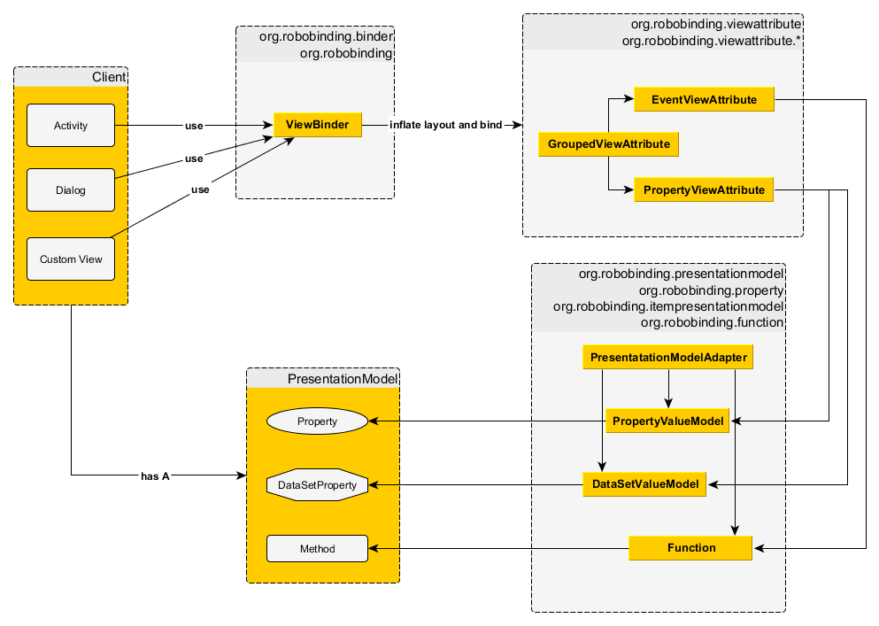

参与开发
========
:toc:

:numbered:

搭建开发环境
------------

aa

:numbered:
RoboBinding架构与实现
---------------------

RoboBinding是一个实现Martin Fowler的http://martinfowler.com/eaaDev/PresentationModel.html[Presentation Model]构架模式的Android框架。
目标为减少Android应用开发工作量；促进清晰的项目结构；使项目代码更易于测试。基于RoboBinding的Android应用的结构如下图。

从Android应用结构上看
~~~~~~~~~~~~~~~~~~~~~

.基于RoboBinding的Android应用
image::images/robobinding_based_app.png[]

一个Android应用包含了若干个Activity以及其它的元素。在基于RoboBinding的应用里一个Activity包含了Activity主文件，Layout文件以及PresentationModel文件
(而Android普通应用一个Activity只包含了Activity主文件与Layout文件)。原先位于Activity内的显示层逻辑被提取到独立的文件PresentationModel内。
Activity利用RoboBinding将Layout与对应的显示逻辑PresentationModel绑定在一起。把Layout中的显示数据与PresentationModel中的属性绑定；
Layout中的事件与PresentationModel中的方法绑定。RoboBinding替代了原先在Activity中的UI关联代码，减少应用代码。
在理想的情况下，PresentationModel只包含显示逻辑不包含UI代码，便与独立测试。

从RoboBinding实现概览上看
~~~~~~~~~~~~~~~~~~~~~~~~

.RoboBinding实现概要图

以上为RoboBinding框架实现的概要。黄色背景的两张图(Client与PresentationModel)为应用代码，其它的三个为框架代码。图中只列举了来自一些包的核心类。
Client(Activity，Dialog或Custom View)将Layout传递给对应的Binder(ActivityBinder, DialogBinder或ViewBinder)，
Binder从给定的Layout文件构建起View层次结构(利用Android的内部LayoutInflater功能)以及RoboBinding绑定信息。
一个根View可能包含若干个子View，子View可能包含下级View，形成一个树状的结构。每一个View中可能包含若干个视图绑定属性。
RoboBinding中定义了三类视图绑定属性，分别是PropertyViewAttribute，CommandViewAttribute，以及GroupedViewAttribute。
PropertyViewAttribute实现Layout中的显示数据与PresentationModel中的属性绑定；CommandViewAttribute实现Layout中的事件与PresentationModel中的方法绑定；
而GroupedViewAttribute由若干个PropertyViewAttribute与CommandViewAttribute组成，用于实现一个复合视图属性由多个子属性构成的情况。
PropertyViewAttribute通过PresentationModelAdapter的PropertyValueModel(如果是简单属性)或DataSetValueModel(如果是复杂的数据集合属性)
映射到PresentationModel的Property或DataSetProperty。CommandViewAttribute通过PresentationModelAdapter的Function映射到PresentationModel的Method。

.RoboBinding实现例子概要图

上图以实例解释了框架的实现概要。黄色背景的三张图摘自RoboBinding-Sample项目的源代码，其它二个为应用运行时框架产生的对应的核心代码实例。
ViewAlbumsActivity通过框架(这里为org.robobinding.binder.Binders类)将layout与presentationModel绑定在一起。
图中的第一个为简单视图属性的绑定例子。框架为++\{windowsTitle\}++产生一个org.robobinding.viewattribute.textview.TextAttribute实例，而TextAttribute实例通过PresentationModelAdapter的PropertyValueModel
将++\{windowTitle\}++与ViewAlbumsPresentationModel.windowTitle绑定在一起。第二个为复合视图属性的绑定例子。ListView的source与itemLayout为复合视图属性，框架为++\{albums\}++与++@layout/album_row++
产生一个org.robobinding.viewattribute.adapterview.AdaptedDataSetAttributes复合视图属性实例，些复合视图属性包含两个子视图属性
org.robobinding.viewattribute.adapterview.SourceAttribute与org.robobinding.viewattribute.adapterview.StaticLayoutAttribute分别和++\{albums\}++及其++@layout/album_row++相对应。
而SourceAttribute实例通过PresentationModelAdapter的DataSetValueModel将++\{albums\}++与ViewAlbumsPresentationModel.albums绑定在一起；
而StaticLayoutAttribute通过解析++@layout/album_row++关联到外部文件album_row.xml。第三个为视图事件属性的绑定例子。
框架为createAlbum产生一个org.robobinding.viewattribute.view.OnClickAttribute实例，而OnClickAttribute实例通过PresentationModelAdapter的Function
将createAlbum与ViewAlbumsPresentationModel.createAlbum绑定在一起。

从RoboBinding实现细节上看
~~~~~~~~~~~~~~~~~~~~~~~~

org.robobinding与org.robobinding.binder包
^^^^^^^^^^^^^^^^^^^^^^^^^^^^^^^^^^^^^^^^^

org.robobinding.viewattribute与org.robobinding.viewattribute$$.*$$包
^^^^^^^^^^^^^^^^^^^^^^^^^^^^^^^^^^^^^^^^^^^^^^^^^^^^^^^^^^^^^^^^^^^^^
.ViewAttribute类层次关系图
image::images/viewattribute_hierarchy.png[]
视图属性主要包含三类：简单视图属性org.robobinding.viewattribute.PropertyViewAttribute，命令视图属性org.robobinding.viewattribute.AbstractCommandViewAttribute，
以及复合视图属性org.robobinding.viewattribute.AbstractGroupedViewAttribute。PropertyViewAttribute为简单视图属性绑定提供实现，
分为两种，即单值简单视图属性org.robobinding.viewattribute.AbstractPropertyViewAttribute与多值简单视图属性org.robobinding.viewattribute.AbstractMultiTypePropertyViewAttribute。
单值简单视图属性AbstractPropertyViewAttribute(如图[1.1]标注的++\{enabledSwitch\}++，++\{selectedSwitch\}++)
即只有一种可能类型的值如org.robobinding.viewattribute.view.EnabledAttribute，只有Boolean类型的值。
多值简单视图属性AbstractMultiTypePropertyViewAttribute(如图[1.2]标注的++\{visibilitySwitch\}++)
即有多种可能类型的值如org.robobinding.viewattribute.view.AbstractVisibilityAttribute控制是否可视，可能有Boolean或Integer类型的值。
AbstractCommandViewAttribute(如图[2]标注的++onClick++，++onLongClick++)为命令视图属性绑定提供实现，
如org.robobinding.viewattribute.view.OnClickAttribute，org.robobinding.viewattribute.view.OnLongClickAttribute等。
AbstractGroupedViewAttribute(如图[3.1，3.2]标注的++\{source\}++，++@layout/item_row++，++\{[text1.text:\{name\}]\}++；++@layout/footer_layout++，++\{footer\}++，++\{footerVisibility\}++)
为复合视图属性绑定提供实现，如org.robobinding.viewattribute.adapterview.AdaptedDataSetAttributes由子属性source，itemLayout以及可选的itemMapping构成；
org.robobinding.viewattribute.listview.FooterAttributes由子属性footerLayout以及可选的footerPresentationModel与footerVisibility构成。
org.robobinding.viewattribute包 包含了主要的概念抽象类，而org.robobinding.viewattribute子包对应android.widget包下的各种widget的视图属性绑定实现。
如org.robobinding.viewattribute.textview包对应android.widget.TextView；org.robobinding.viewattribute.seekbar包对应android.widget.SeekBar。

.ChildViewAttributes类关系图
image::images/childviewattribute_relationship.png[]
阶段：inflateView；bindTo； preinitializeViews

org.robobinding.presentationmodel，org.robobinding.property，org.robobinding.itempresentationmodel以及org.robobinding.function包
^^^^^^^^^^^^^^^^^^^^^^^^^^^^^^^^^^^^^^^^^^^^^^^^^^^^^^^^^^^^^^^^^^^^^^^^^^^^^^^^^^^^^^^^^^^^^^^^^^^^^^^^^^^^^^^^^^^^^^^^^^^^^^^
.PresentationModel类关系图
image::images/presentationmodel_classdiagram.png[]
org.robobinding.presentationmodel，org.robobinding.property，org.robobinding.itempresentationmodel以及org.robobinding.function
这四个包的相关的类主要用于包装应用程序的PresentationModel。org.robobinding.presentationmodel.PresentationModelAdapter为这几个包的入口类。
框架为每一个应用程序PresentationModel生成一个对应的PresentationModelAdapter实例。目前框架通过两种方式识别应用程序PresentationModel，
即所有org.robobinding.presentationmodel.ObservableProperties/AbstractPresentationModel的子类或有
org.robobinding.presentationmodel.PresentationModel annotation标识的类。PresentationModelAdapter主要包装应用程序PresentationModel的三类信息，
即将SimpleProperty，DataSetProperty和Method包装为org.robobinding.property.PropertyValueModel，org.robobinding.property.DataSetValueModel
和org.robobinding.function.Function。上图右边的例子中：windowTitle为SimpleProperty,albums为DataSetProperty，createAlbum为Method。
DataSetProperty是一个数据集属性，其中每一个数据项又会生成一个org.robobinding.itempresentationmodel.ItemPresentationModel实例，
上图中即为AlbumItemPresentationModel，其与对应的++@layout/album_row++配合显示相应的行。框架通过Aspectj为一些类自动的注入一些代码，以减少工作量。
例如为PresentationModel注入PresentationModelAspect，主要为Setter方法尾部追加属性值变更事件通知代码；
为ItemPresentationModel注入ItemPresentationModelAspect，即为ItemPresentationModel.updateData方法的尾部加上数据项变更刷新ItemPresentationModel代码。

成为项目开发成员
----------------
项目为免费的开源项目，纯粹出于我们的个人兴趣发起的，是没有任何报酬的，我们都是利用我们的个人空闲时间来开发与维护项目。
项目的价值与宗旨是：通过参与项目，我们从中得到快乐(享受程序开发艺术以及顺畅的成员协作关系)，相互学习知识以及开发经验。
如果该项目有幸被Android开发者们认可，为Android社区做出贡献，我们将从中得到及大的满足。

参与项目技能要求
~~~~~~~~~~~~~~~~
* 具有丰富的测试驱动开发经验。
* 具有丰富的面向对象编程经验。

参与项目规则要求
~~~~~~~~~~~~~~~~
* 协作胜于个人主义。例如：当组员在开发一个任务时遇到困难，如果另一个组员有相应的知识时，应该帮助有困难的组员，但前提为不是替他完成这个任务；
我们应该尽快的处理其他组员的email，合并请求等，尽可能的不耽搁其他组员的任务开发。
* 参与以及知识分享的最大化。我们提倡组员分享和参与项目的所有部分。至少做到每一个部分都有两个以上的人参与。