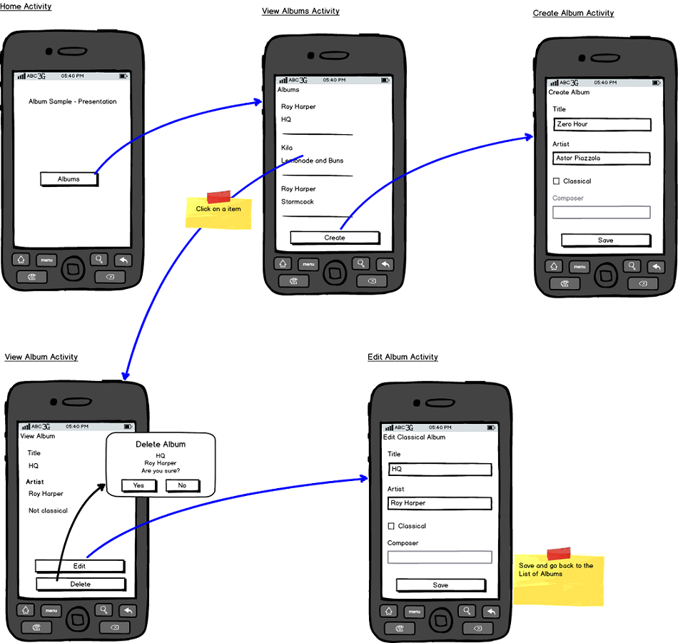

入门
====
:toc:

:numbered:

RoboBinding是什么?
------------------
定义+Hello Robobinding

Setup
-----
* Maven
* Eclipse
* ProGuard

Album唱片集例子项目学习
-----------------------
项目中所带的Album唱片集例子是将Martin Fowler的原始版本翻译成基于RoboBinding的Android版本(Martin Fowler基于.Net的http://martinfowler.com/eaaDev/PresentationModel.html[原始版本])。
可以从https://github.com/RoboBinding/RoboBinding[RoboBinding链接]下找到robobinding-sample项目。

将项目导入Eclipse。文件->导入->Android->已存在的Android代码到工作区->浏览选择robobinding-sample文件夹，导入即可。

.Album唱片集例子原型

以上是Album唱片集例子原型图。项目遵循RoboBinding应用的标准结构，即一个Activity由Activity主Java文件，Layout文件与PresentationModel Java文件组成。
项目源代码中包含以下几个包：sample.robobinding.activity包含所有Activity的主Java文件，sample.robobinding.presentationmodel包含所有PresentationModel Java文件，
sample.robobinding.model仅包含一个Album实体实现文件，sample.robobinding.store包含一个基于内存Album实体存储实现AlbumStore。
接下来列出上述五张图所对应的实现文件。
图[Home Activity]由sample.robobinding.activity.HomeActivity，home_activity.xml与sample.robobinding.presentationmodel.HomePresentationModel组成。
图[View Albums Activity]由sample.robobinding.activity.ViewAlbumsActivity，view_albums_activity.xml与sample.robobinding.presentationmodel.ViewAlbumsPresentationModel组成;
其唱片集每行的唱片信息由sample.robobinding.presentationmodel.AlbumItemPresentationModel与album_row.xml组成；以及一个当唱片集为空时Layout显示文件albums_empty_view.xml。
图[Create Album Activity]与图[Edit Album Activity]由相同的sample.robobinding.activity.CreateEditAlbumActivity，create_edit_album_activity.xml与sample.robobinding.presentationmodel.CreateEditAlbumPresentationModel组成。
图[View Album Activity]由sample.robobinding.activity.ViewAlbumActivity，view_album_activity.xml与sample.robobinding.presentationmodel.ViewAlbumPresentationModel组成；
其删除对话框由sample.robobinding.activity.DeleteAlbumDialog，delete_album_dialog.xml与DeleteAlbumDialogPresentationModel组成。

以下以[View Albums Activity]为例，对源代码做简单介绍。Activity主Java文件ViewAlbumsActivity只做了一件事，就是把Layout文件view_albums_activity.xml与ViewAlbumsPresentationModel关联起来。
view_albums_activity.xml里包含了三个子视图按顺序为TextView, ListView与Button。TextView没有包含任何绑定信息。
ListView的++bind:source="\{albums\}"++绑定到ViewAlbumsPresentationModel.albums数据集属性。
++bind:onItemClick="viewAlbum"++绑定到ViewAlbumsPresentationModel.viewAlbum(ItemClickEvent)方法，单击某个唱片项时，该事件方法将被调用。
++bind:emptyViewLayout="@layout/albums_empty_view"++设置了当唱片集为空时的显示内容Layout。
++bind:itemLayout="@layout/album_row"++设置了唱片项的行显示Layout，结合在ViewAlbumsPresentationModel.albums上给出的数据项PresentationModel，即++@ItemPresentationModel(AlbumItemPresentationModel.class)++，
来显示每一个唱片行。在album_row.xml里包含了两个简单的TextView，其++bind:text="\{title\}"++与++bind:text="\{artist\}"++分别绑定到AlbumItemPresentationModel.title/artist属性。
在view_albums_activity.xml里的最后一个Button视图，++bind:onClick="createAlbum"++绑定到ViewAlbumsPresentationModel.createAlbum()方法。

目前支持的绑定属性列表
----------------------

Layout文件Robobinding语法校验器插件
-----------------------------------

其它资源
--------
*2012年一月* Robert Taylor 写了一些入门的文章在http://roberttaylor426.blogspot.com/2011/11/hello-robobinding-part-1.html[这里] 和 http://roberttaylor426.blogspot.com/2012/01/hello-robobinding-part-2.html[这里].

*2012年二月* 在London SkillsMatter，Robert Taylor作的RoboBinding介绍视频可以在http://skillsmatter.com/podcast/os-mobile-server/core-dev-talk-robobinding[这里]找到。
